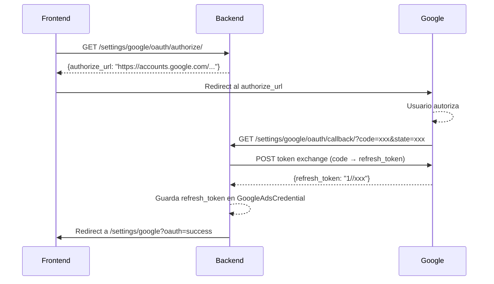

# Referencia API

Todos los endpoints están bajo el prefijo `/api/v1/`. La documentación interactiva (Swagger UI) está disponible en `/api/v1/docs/`.

## Autenticación

Todos los endpoints (excepto `health` y `login`) requieren autenticación mediante uno de estos métodos:

| Método | Header | Formato |
|--------|--------|---------|
| **API Key** | `X-API-Key` | `sk-...` (obtenido en login) |
| **JWT Bearer** | `Authorization` | `Bearer <access_token>` |

---

## Endpoints

### Health

| Método | Endpoint | Auth | Descripción |
|--------|----------|------|-------------|
| `GET` | `/api/v1/health/` | No | Health check del servicio |

**Response 200:**
```json
{
  "status": "ok",
  "version": "1.0.0",
  "timestamp": "2025-02-25T21:00:00Z"
}
```

---

### Auth — Session (API Key)

#### Login

| Método | Endpoint | Auth | Descripción |
|--------|----------|------|-------------|
| `POST` | `/api/v1/auth/login/` | No | Crea sesión y retorna API Key efímera (24h) |

**Request:**
```json
{
  "username": "admin",
  "password": "secret123"
}
```

**Response 200:**
```json
{
  "api_key": "sk-abc123...",
  "user": {
    "username": "admin",
    "email": "admin@example.com",
    "role": "admin"
  },
  "organization": {
    "name": "My Company",
    "slug": "my-company"
  }
}
```

**Response 401:** `{"detail": "Invalid credentials."}`

#### Logout

| Método | Endpoint | Auth | Descripción |
|--------|----------|------|-------------|
| `POST` | `/api/v1/auth/logout/` | Sí | Destruye la API Key de sesión actual |

**Response 200:** `{"detail": "Session destroyed."}`

#### Cambiar Contraseña

| Método | Endpoint | Auth | Descripción |
|--------|----------|------|-------------|
| `POST` | `/api/v1/auth/change-password/` | Sí | Cambia contraseña y destruye todas las sesiones |

**Request:**
```json
{
  "current_password": "old_pass",
  "new_password": "new_pass_min_8_chars"
}
```

**Response 200:** `{"detail": "Password changed. Please log in again."}`

---

### Auth — JWT (Alternativo)

| Método | Endpoint | Auth | Descripción |
|--------|----------|------|-------------|
| `POST` | `/api/v1/token/` | No | Obtener par access/refresh token |
| `POST` | `/api/v1/token/refresh/` | No | Refrescar access token |

**Request (token):**
```json
{
  "username": "admin",
  "password": "secret123"
}
```

**Response 200:**
```json
{
  "access": "eyJ...",
  "refresh": "eyJ..."
}
```

**Config JWT:**
- Access token: **1 hora**
- Refresh token: **7 días**
- Rotate refresh tokens: activado

---

### Audits

| Método | Endpoint | Auth | Descripción |
|--------|----------|------|-------------|
| `GET` | `/api/v1/audits/` | Sí | Listar auditorías |
| `GET` | `/api/v1/audits/{run_id}/` | Sí | Detalle de auditoría |
| `DELETE` | `/api/v1/audits/{run_id}/` | Sí | Eliminar auditoría |
| `POST` | `/api/v1/audits/run/` | Sí | Lanzar nueva auditoría |
| `GET` | `/api/v1/audits/{run_id}/status/` | Sí | Polling de estado |
| `GET` | `/api/v1/audits/{run_id}/download/` | Sí | Descargar reporte |

#### Lanzar Auditoría

**Request (demo):**
```json
{
  "source": "demo",
  "demo_key": "demo-moderate"
}
```

**Request (live):**
```json
{
  "source": "live",
  "account_id": "123-456-7890",
  "start_date": "2025-01-01",
  "end_date": "2025-01-31"
}
```

**Demo keys disponibles:** `demo-moderate`, `demo-critical`, `demo-excellent`

**Response 202:**
```json
{
  "status": "accepted",
  "run_id": "550e8400-e29b-41d4-a716-446655440000"
}
```

#### Polling de Estado

**Response 200:**
```json
{
  "status": "running",
  "composite_score": null,
  "progress": 45
}
```

**Status posibles:** `pending` → `running` → `success` | `failed`

#### Detalle de Auditoría

Incluye domain scores, red flags, y reportes disponibles.

---

### Users (Solo Admin)

| Método | Endpoint | Auth | Descripción |
|--------|----------|------|-------------|
| `GET` | `/api/v1/users/` | Admin | Listar usuarios de la organización |
| `POST` | `/api/v1/users/` | Admin | Crear usuario |
| `GET` | `/api/v1/users/{id}/` | Admin | Detalle de usuario |
| `PATCH` | `/api/v1/users/{id}/` | Admin | Actualizar usuario |
| `DELETE` | `/api/v1/users/{id}/` | Admin | Desactivar usuario (soft delete) |

**Request (crear):**
```json
{
  "username": "analyst1",
  "email": "analyst@example.com",
  "password": "secure_pass",
  "first_name": "John",
  "last_name": "Doe",
  "role": "user"
}
```

**Nota:** `DELETE` no elimina el usuario, solo lo desactiva (`is_active=false`). No se puede eliminar la propia cuenta.

---

### Red Flag Rules

| Método | Endpoint | Auth | Descripción |
|--------|----------|------|-------------|
| `GET` | `/api/v1/red-flags/` | Sí | Listar reglas (globales + org) |
| `POST` | `/api/v1/red-flags/` | Sí | Crear regla custom |
| `GET` | `/api/v1/red-flags/{id}/` | Sí | Detalle de regla |
| `PUT` | `/api/v1/red-flags/{id}/` | Sí | Actualizar regla |
| `PATCH` | `/api/v1/red-flags/{id}/` | Sí | Actualizar parcial |
| `DELETE` | `/api/v1/red-flags/{id}/` | Sí | Eliminar regla (solo custom) |

**Nota:** Las reglas de sistema (`is_system=true`) no se pueden eliminar (403).

---

### Settings

#### Google Ads Config

| Método | Endpoint | Auth | Descripción |
|--------|----------|------|-------------|
| `GET` | `/api/v1/settings/google/` | Sí | Obtener credenciales (masked) |
| `POST` | `/api/v1/settings/google/` | Sí | Guardar credenciales |
| `GET` | `/api/v1/settings/google/test/` | Sí | Test de conexión |
| `GET` | `/api/v1/settings/google/accounts/` | Sí | Listar cuentas accesibles bajo el MCC |

**Request (guardar):**
```json
{
  "developer_token": "abc123",
  "client_id": "xxx.apps.googleusercontent.com",
  "client_secret": "GOCSPX-xxx",
  "mcc_id": "123-456-7890",
  "api_version": "v23"
}
```

> **Nota**: El campo `refresh_token` ya no se envía manualmente. Se obtiene automáticamente mediante el flujo OAuth2 (ver sección siguiente).

> **Nota**: Los campos sensibles (`developer_token`, `client_secret`, `refresh_token`) se retornan masked en GET (e.g. `****FWj8`). Al hacer POST, los valores que empiecen con `****` son ignorados para no sobreescribir el valor real.

**Response (test connection):**
```json
{
  "connected": true,
  "message": "Connected. Found 3 accounts.",
  "accounts": [
    { "id": "123-456-7890", "name": "My Client Account" },
    { "id": "098-765-4321", "name": "Another Account" }
  ]
}
```

**Response (accounts list):**
```json
{
  "accounts": [
    { "id": "123-456-7890", "name": "My Client Account" },
    { "id": "098-765-4321", "name": "Another Account" }
  ]
}
```

> Si las credenciales no están completas o la conexión falla, `accounts` retorna un array vacío.

#### Google OAuth2 (Refresh Token automático)

| Método | Endpoint | Auth | Descripción |
|--------|----------|------|-------------|
| `GET` | `/api/v1/settings/google/oauth/authorize/` | Sí | Genera URL de consentimiento de Google |
| `GET` | `/api/v1/settings/google/oauth/callback/` | No | Callback de Google — intercambia code por refresh token |
| `GET` | `/api/v1/settings/google/oauth/status/` | Sí | Verifica si hay refresh token guardado |

**Flujo OAuth2:**



**Response (authorize):**
```json
{
  "authorize_url": "https://accounts.google.com/o/oauth2/v2/auth?client_id=...&scope=...&state=..."
}
```

**Response (status):**
```json
{
  "connected": true,
  "has_refresh_token": true
}
```

**Requisito**: Se debe guardar Client ID y Client Secret antes de iniciar el flujo OAuth2. Además, la **Authorized redirect URI** en Google Cloud Console debe incluir la URL del callback del backend (e.g., `http://localhost:8000/api/v1/settings/google/oauth/callback/`).

#### Scoring Config

| Método | Endpoint | Auth | Descripción |
|--------|----------|------|-------------|
| `GET` | `/api/v1/settings/scoring/` | Sí | Obtener pesos y branding |
| `POST` | `/api/v1/settings/scoring/` | Sí | Guardar configuración |

#### Report Config

| Método | Endpoint | Auth | Descripción |
|--------|----------|------|-------------|
| `GET` | `/api/v1/settings/report/` | Sí | Obtener config de reporte |
| `POST` | `/api/v1/settings/report/` | Sí | Guardar config |

---

### OpenAPI Schema

| Método | Endpoint | Auth | Descripción |
|--------|----------|------|-------------|
| `GET` | `/api/v1/schema/` | No | Schema OpenAPI 3 (JSON) |
| `GET` | `/api/v1/docs/` | No | Swagger UI interactivo |

---

## Paginación

Todos los endpoints de listado usan `PageNumberPagination`:

```json
{
  "count": 42,
  "next": "http://localhost:8000/api/v1/audits/?page=2",
  "previous": null,
  "results": [...]
}
```

**Tamaño de página por defecto:** 50

## Códigos de Error Comunes

| Código | Significado |
|--------|-------------|
| `400` | Bad Request — datos inválidos |
| `401` | Unauthorized — credenciales inválidas o sesión expirada |
| `403` | Forbidden — sin permisos (e.g., no admin, o regla de sistema) |
| `404` | Not Found |
| `202` | Accepted — auditoría en cola |
