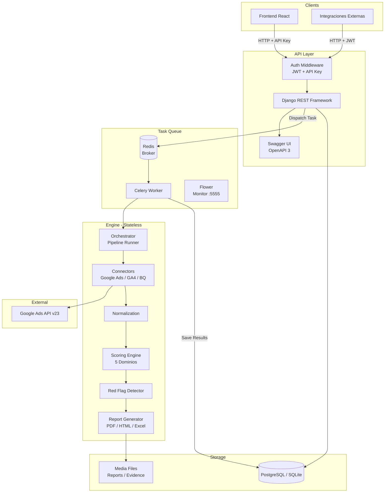
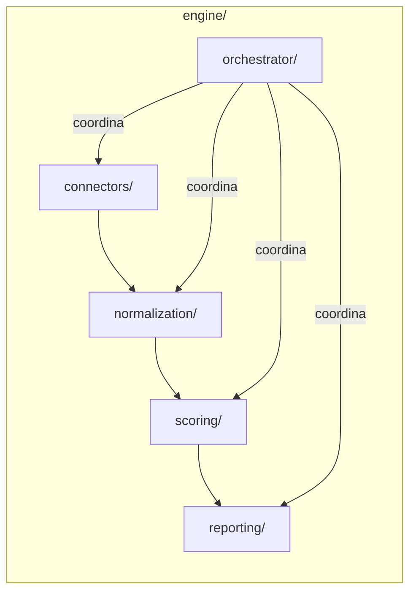
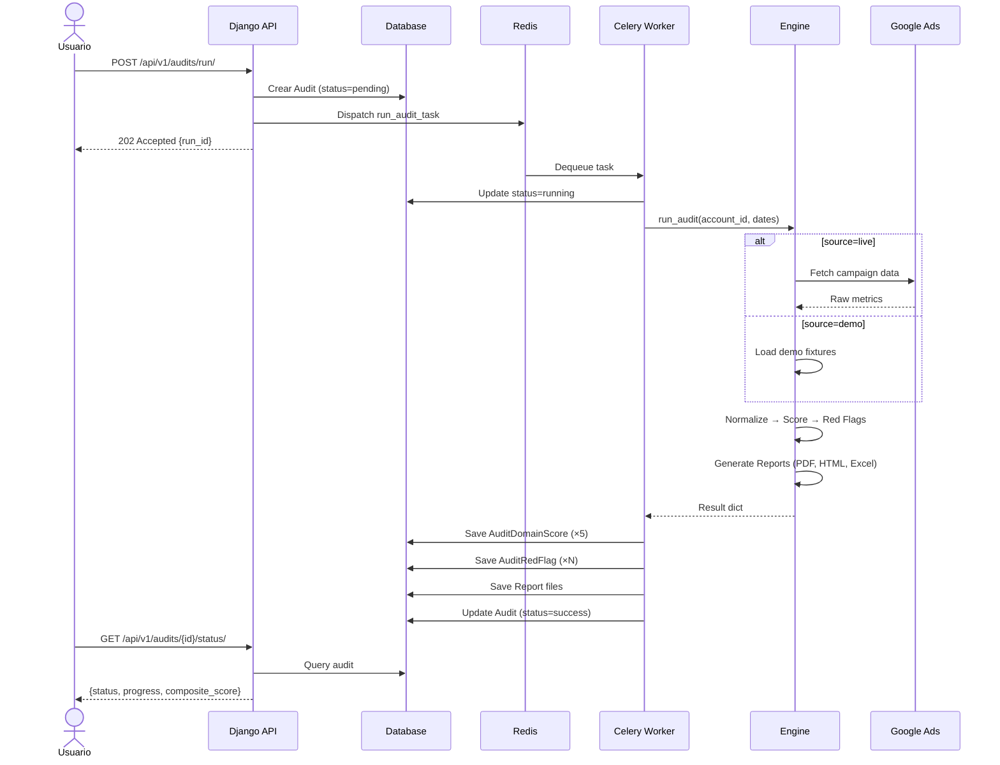
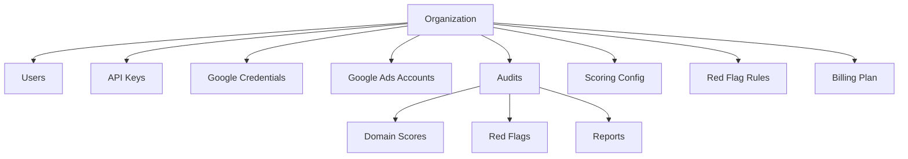

# Arquitectura del Sistema

## Visión General

Media Integrity API es un backend multi-tenant que analiza cuentas de Google Ads y genera reportes de integridad estructural. El sistema evalúa 5 dominios de scoring, detecta red flags y produce reportes en múltiples formatos.

## Diagrama de Arquitectura General

## Componentes Principales

### 1. API Layer (`api/`)

Capa REST construida con Django REST Framework. Maneja autenticación, serialización, permisos y routing.

- **Autenticación dual**: JWT (SimpleJWT) + API Key custom (`X-API-Key`)
- **OAuth2**: Flujo de autorización Google para obtener refresh token automáticamente (`/settings/google/oauth/`)
- **Permisos**: `IsAuthenticated` por defecto, `IsAdmin` para gestión de usuarios
- **Paginación**: PageNumberPagination (50 items/página)
- **Filtros**: DjangoFilterBackend + SearchFilter + OrderingFilter
- **Schema**: drf-spectacular genera OpenAPI 3 automáticamente

### 2. Core Models (`core/`)

13 modelos Django organizados en 5 grupos:

- **Tenant & Auth**: Organization, User, ApiKey
- **Billing**: BillingPlan (placeholder post-MVP)
- **Google Ads**: GoogleAdsCredential, GoogleAdsAccount
- **Settings**: ScoringConfig, ReportConfig, RedFlagRule
- **Audits**: Audit, AuditDomainScore, AuditRedFlag, Report

### 3. Engine (`engine/`)

Motor de análisis stateless — no depende de Django ORM. Procesamiento puro de datos.

| Módulo | Responsabilidad |
|--------|----------------|
| `connectors/` | Extracción de datos (Google Ads, GA4, BigQuery) |
| `normalization/` | Normalización y limpieza de métricas |
| `scoring/` | Cálculo de scores por dominio + composite |
| `reporting/` | Generación de reportes (PDF, HTML, Excel, ZIP) |
| `orchestrator/` | Pipeline que coordina todo el flujo |

### 4. Task Queue (`tasks/`)

Celery ejecuta auditorías en background. El flujo:

1. API recibe `POST /api/v1/audits/run/`
2. Crea registro `Audit` con status `pending`
3. Despacha `run_audit_task` a Celery via Redis
4. Worker ejecuta pipeline completo del engine
5. Resultados se guardan en tablas normalizadas

### 5. Config (`config/`)

Configuración Django estándar con settings split:

- `settings/base.py` — Compartido (DRF, JWT, CORS, Celery)
- `settings/development.py` — SQLite, DEBUG=True
- `celery.py` — App Celery
- `urls.py` — Root URL conf

## Diagrama de Secuencia — Flujo de Auditoría

## Multi-Tenancy

El sistema implementa **tenant isolation** a nivel de organización:

- Cada usuario pertenece a una organización
- Queries filtran por `organization` del usuario autenticado
- Superusers pueden ver todo
- Admins ven toda su organización
- Users regulares ven solo sus propios audits
