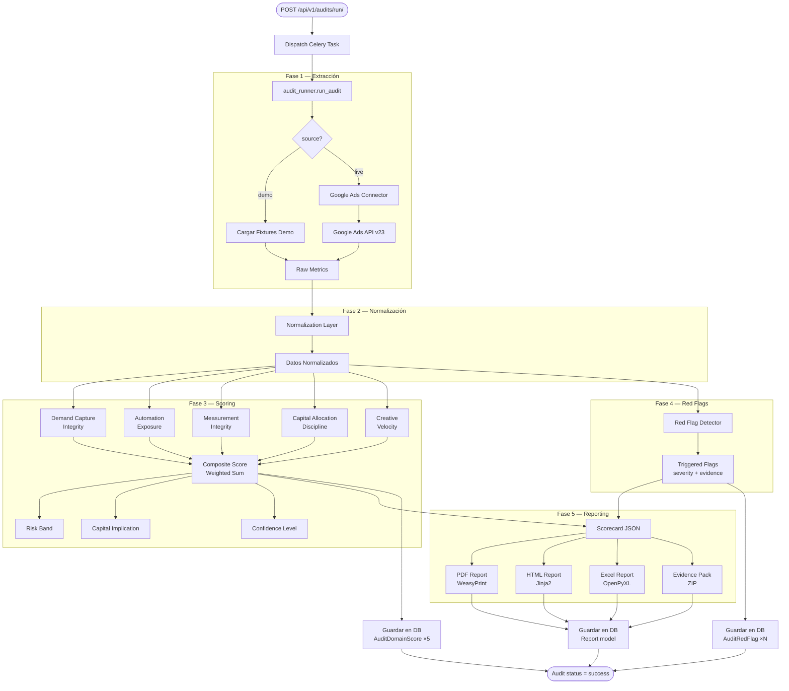
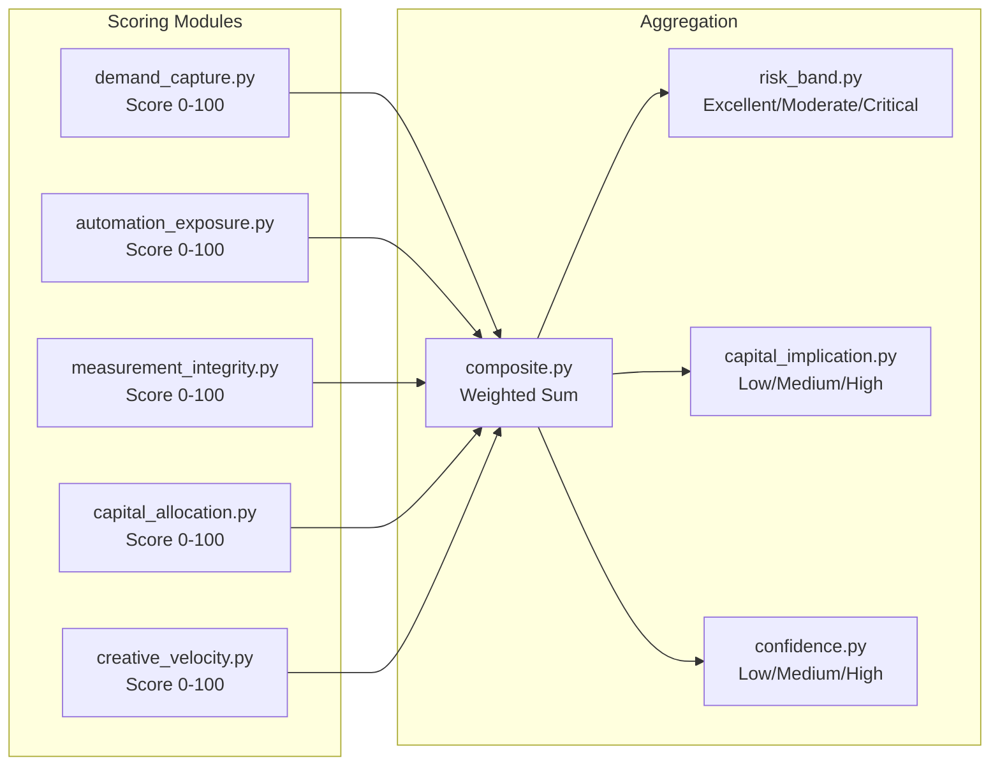
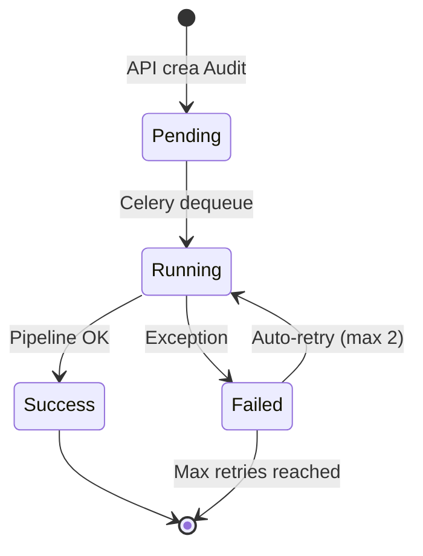

# Pipeline de Auditoría

## Visión General

El motor de auditoría (`engine/`) es un pipeline stateless que extrae datos de Google Ads, los normaliza, calcula scores en 5 dominios, detecta red flags y genera reportes en múltiples formatos.

## Diagrama del Pipeline

## Módulos del Engine

### 1. Connectors (`engine/connectors/`)

Extraen datos de fuentes externas:

| Connector | Descripción |
|-----------|-------------|
| `google_ads/` | Extrae campaigns, ad groups, keywords, ads, conversions |
| `ga4/` | Google Analytics 4 (complementario) |
| `bigquery/` | Queries directos para datos avanzados |
| `base_connector.py` | Clase base con interfaz común |

Todos los connectors heredan de `BaseConnector` e implementan:
- Extracción de métricas crudas
- Manejo de paginación y rate limits
- Modo demo (fixtures locales)

### 2. Normalization (`engine/normalization/`)

Transforma métricas crudas a un formato normalizado consistente:

- Limpieza de valores nulos
- Normalización de rangos (0-100)
- Cálculo de métricas derivadas
- Agregaciones por período

### 3. Scoring (`engine/scoring/`)

Calcula scores independientes por dominio:

| Módulo | Evalúa |
|--------|--------|
| `demand_capture.py` | Coverage de keywords, match types, impression share |
| `automation_exposure.py` | Smart bidding adoption, automated rules, scripts |
| `measurement_integrity.py` | Conversiones configuradas, attribution models, tracking |
| `capital_allocation.py` | Budget pacing, spend distribution, waste detection |
| `creative_velocity.py` | Ad variations, testing frequency, RSA adoption |
| `red_flags.py` | Evalúa reglas contra métricas → genera alertas |
| `composite.py` | Suma ponderada de los 5 dominios |
| `risk_band.py` | Mapea composite score a banda de riesgo |
| `capital_implication.py` | Estimación de impacto financiero |
| `confidence.py` | Nivel de confianza basado en completeness de datos |

### 4. Reporting (`engine/reporting/`)

Genera outputs en múltiples formatos:

| Módulo | Output | Tecnología |
|--------|--------|-----------|
| `scorecard_generator.py` | JSON scorecard | Python dict → JSON |
| `pdf_generator.py` | PDF report | WeasyPrint (HTML→PDF) |
| `html_renderer.py` | HTML report | Jinja2 templates |
| `excel_export.py` | XLSX workbook | OpenPyXL (multi-sheet) |
| `evidence_pack.py` | ZIP evidence | zipfile |

Templates HTML en `engine/reporting/templates/`.

### 5. Orchestrator (`engine/orchestrator/`)

Coordina todo el pipeline:

| Archivo | Función |
|---------|---------|
| `audit_runner.py` | Entry point: `run_audit()` — coordina extracción → normalización → scoring → reporting |
| `pipeline.py` | Pipeline stages con manejo de errores y logging |
| `run_manifest.py` | Metadata de la ejecución (timestamps, stats) |

## Celery Task (`tasks/audit_tasks.py`)

El task `run_audit_task` es el puente entre Django y el Engine:

**Configuración del task:**
- `bind=True` — acceso a `self` para retries
- `max_retries=2` — máximo 2 reintentos
- `default_retry_delay=60` — 60 segundos entre retries

**Datos guardados en DB tras éxito:**
1. `Audit` — composite_score, risk_band, capital_implication, confidence, full_result
2. `AuditDomainScore` × 5 — un row por dominio
3. `AuditRedFlag` × N — un row por flag disparado
4. `Report` × M — un row por archivo generado (PDF, HTML, Excel, JSON, ZIP)

## Demo Mode

Cuando `source=demo`, el engine carga fixtures locales en lugar de hacer requests a Google Ads:

| Demo Key | Escenario |
|----------|-----------|
| `demo-moderate` | Cuenta con score moderado (~60-70) |
| `demo-critical` | Cuenta con problemas serios (~30-40) |
| `demo-excellent` | Cuenta bien optimizada (~85-95) |

Fixtures almacenados en `engine/fixtures/`.
