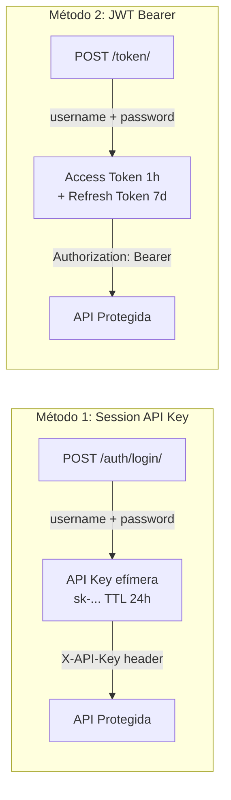
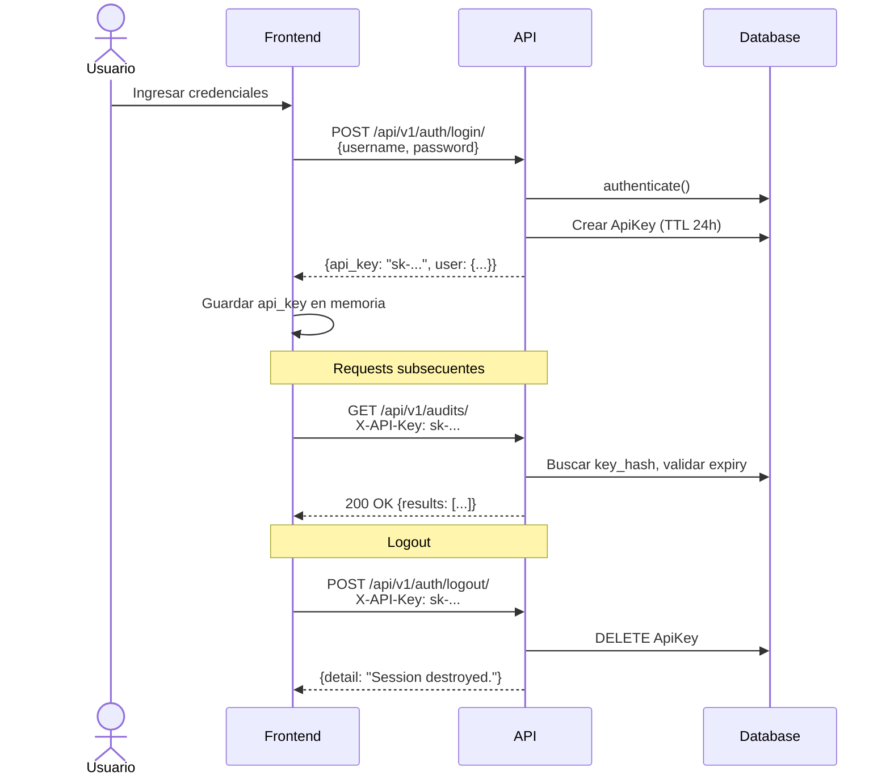

# Autenticación

El sistema soporta dos métodos de autenticación que pueden usarse indistintamente.

## Métodos de Autenticación



## 1. Session API Key (Recomendado para Frontend)

Diseñado para el frontend React. Crea una API Key efímera vinculada al usuario.

### Flujo Completo



### Características

- **TTL**: 24 horas desde la creación
- **Formato**: `sk-{random_urlsafe_32}` (e.g., `sk-a1b2c3d4...`)
- **Almacenamiento**: Solo se guarda el hash SHA-256 en DB
- **Scopes**: `["session"]` para keys de sesión
- **Auto-org**: Si el usuario no tiene organización, se crea una personal automáticamente
- **Cleanup**: Keys expiradas se eliminan al intentar autenticar

### Uso

```bash
# Login
curl -X POST http://localhost:8000/api/v1/auth/login/ \
  -H "Content-Type: application/json" \
  -d '{"username": "admin", "password": "secret"}'

# Usar API Key
curl http://localhost:8000/api/v1/audits/ \
  -H "X-API-Key: sk-abc123..."

# Logout
curl -X POST http://localhost:8000/api/v1/auth/logout/ \
  -H "X-API-Key: sk-abc123..."
```

## 2. JWT Bearer (Para Integraciones)

Autenticación stateless usando JSON Web Tokens. Ideal para integraciones externas.

### Configuración

| Parámetro | Valor |
|-----------|-------|
| Access Token Lifetime | 1 hora |
| Refresh Token Lifetime | 7 días |
| Rotate Refresh Tokens | Sí |
| Header Type | `Bearer` |

### Uso

```bash
# Obtener tokens
curl -X POST http://localhost:8000/api/v1/token/ \
  -H "Content-Type: application/json" \
  -d '{"username": "admin", "password": "secret"}'
# → {"access": "eyJ...", "refresh": "eyJ..."}

# Usar access token
curl http://localhost:8000/api/v1/audits/ \
  -H "Authorization: Bearer eyJ..."

# Refrescar token
curl -X POST http://localhost:8000/api/v1/token/refresh/ \
  -H "Content-Type: application/json" \
  -d '{"refresh": "eyJ..."}'
# → {"access": "eyJ...", "refresh": "eyJ..."} (nuevo par)
```

## Backend de Autenticación (api/authentication.py)

El backend `ApiKeyAuthentication` implementa:

1. Lee header `X-API-Key` del request
2. Calcula SHA-256 del key recibido
3. Busca en DB un `ApiKey` activo con ese hash
4. Verifica que no esté expirado (si tiene `expires_at`)
5. Si expiró → elimina el key y retorna 401
6. Actualiza `last_used_at`
7. Retorna `(user, api_key_obj)` como tupla de auth

## Cambio de Contraseña

`POST /api/v1/auth/change-password/` destruye **todas** las sesiones activas del usuario, forzando re-login en todos los dispositivos.

## Permisos

| Permiso | Endpoints |
|---------|-----------|
| `AllowAny` | health, login, token, schema, docs |
| `IsAuthenticated` | audits, settings, red-flags, logout, change-password |
| `IsAdmin` | users (CRUD completo) |

`IsAdmin` verifica que `user.role == "admin"` o `user.is_superuser`.
