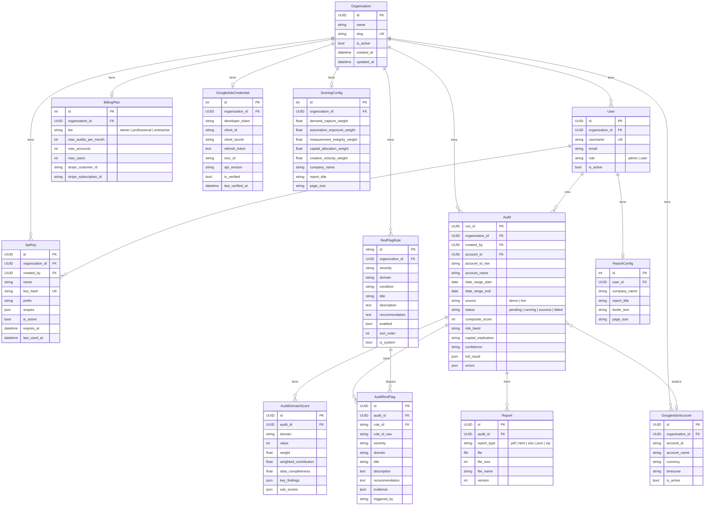

# Modelo de Datos

## Diagrama Entidad-Relación

## Descripción de Entidades

### Tenant & Auth

| Modelo | Tabla | Descripción |
|--------|-------|-------------|
| **Organization** | `core_organization` | Tenant principal. Cada empresa tiene su organización aislada. |
| **User** | `auth_user` | Extiende `AbstractUser`. Vinculado a una organización con rol `admin` o `user`. |
| **ApiKey** | `core_apikey` | Claves de API por organización. Soporta keys de sesión efímeras y keys permanentes. |

### Billing

| Modelo | Tabla | Descripción |
|--------|-------|-------------|
| **BillingPlan** | `core_billingplan` | Plan de suscripción (Starter/Professional/Enterprise). Placeholder post-MVP. Integración con Stripe. |

### Google Ads

| Modelo | Tabla | Descripción |
|--------|-------|-------------|
| **GoogleAdsCredential** | `core_googleadscredential` | Credenciales OAuth por organización (developer token, client ID/secret, refresh token, MCC ID). |
| **GoogleAdsAccount** | `core_googleadsaccount` | Cuentas descubiertas bajo un MCC. Unique constraint `(organization, account_id)`. |

### Settings & Rules

| Modelo | Tabla | Descripción |
|--------|-------|-------------|
| **ScoringConfig** | `core_scoringconfig` | Pesos de los 5 dominios + branding del reporte. Uno por organización. |
| **ReportConfig** | `core_reportconfig` | Configuración de reporte por usuario (nombre empresa, título, footer, tamaño página). |
| **RedFlagRule** | `core_redflagrule` | Reglas de red flags. Pueden ser globales (`organization=null`) o por organización. Las reglas de sistema (`is_system=true`) no se pueden eliminar. |

### Audits

| Modelo | Tabla | Descripción |
|--------|-------|-------------|
| **Audit** | `core_audit` | Entidad central. Una auditoría ejecutada con status, scores, y resultado completo en JSON. |
| **AuditDomainScore** | `core_auditdomainscore` | 5 filas por auditoría (una por dominio). Score, peso, contribución ponderada, sub-scores. |
| **AuditRedFlag** | `core_auditredflag` | 0-N red flags disparados en una auditoría. Vinculados a la regla original. |
| **Report** | `core_report` | Archivos generados (PDF, HTML, Excel, JSON scorecard, Evidence Pack ZIP). Versionados. |

## Dominios de Scoring

Cada auditoría produce 5 domain scores:

| Dominio | Clave | Peso Default |
|---------|-------|-------------|
| Demand Capture Integrity | `demand_capture_integrity` | 0.25 |
| Automation Exposure | `automation_exposure` | 0.20 |
| Measurement Integrity | `measurement_integrity` | 0.25 |
| Capital Allocation Discipline | `capital_allocation_discipline` | 0.20 |
| Creative Velocity | `creative_velocity` | 0.10 |

El **composite score** (0-100) es la suma ponderada de los 5 dominios.
