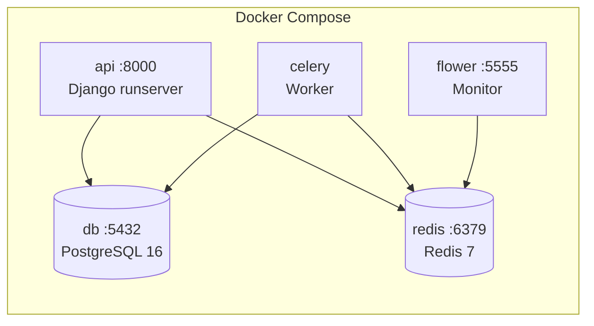
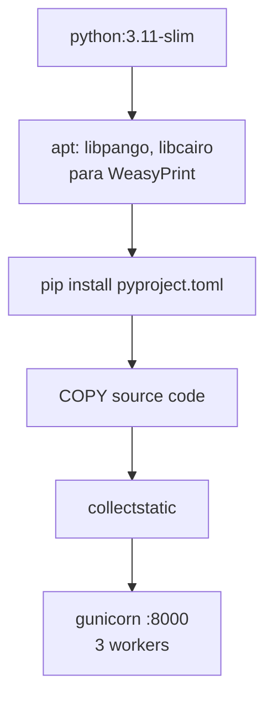

# Despliegue y CI/CD

## Entornos

| Entorno | Base de datos | Settings | Debug |
|---------|--------------|----------|-------|
| **Development** | SQLite | `config.settings.development` | `True` |
| **Production** | PostgreSQL 16 | `config.settings.production` | `False` |
| **CI** | SQLite | `config.settings.development` | `True` |

## Variables de Entorno

Definidas en `.env` (ver `.env.example`):

| Variable | Descripción | Default |
|----------|-------------|---------|
| `SECRET_KEY` | Django secret key | (insecure dev key) |
| `DJANGO_SETTINGS_MODULE` | Settings module | `config.settings.development` |
| `ALLOWED_HOSTS` | Hosts permitidos (comma-separated) | `*` |
| `ALLOWED_ORIGINS` | CORS origins (comma-separated) | `http://localhost:3000` |
| `FRONTEND_URL` | URL del frontend (para redirect OAuth2) | `http://localhost:3000` |
| `DATABASE_URL` | URL PostgreSQL (prod) | — |
| `CELERY_BROKER_URL` | Redis URL para Celery | `redis://localhost:6379/0` |
| `CELERY_RESULT_BACKEND` | Redis URL para resultados | `redis://localhost:6379/0` |
| `AWS_ACCESS_KEY_ID` | S3 storage (prod) | — |
| `AWS_SECRET_ACCESS_KEY` | S3 storage (prod) | — |
| `AWS_STORAGE_BUCKET_NAME` | S3 bucket name | — |

---

## Desarrollo Local

### Opción 1: Sin Docker

```bash
# 1. Clonar e instalar
git clone https://github.com/alealvarezgalan87/media-integrity-api.git
cd media-integrity-api
pip install -e .

# 2. Copiar env
cp .env.example .env

# 3. Migraciones + datos iniciales
python manage.py migrate
python manage.py createsuperuser
python manage.py seed_rules

# 4. Iniciar servidor
python manage.py runserver 8000
```

**Accesos:**
- API: http://localhost:8000/api/v1/
- Admin: http://localhost:8000/admin/
- Swagger: http://localhost:8000/api/v1/docs/

### Opción 2: Docker Compose

```bash
cp .env.example .env
docker-compose up

# Primera vez:
docker-compose exec api python manage.py migrate
docker-compose exec api python manage.py createsuperuser
docker-compose exec api python manage.py seed_rules
```

**Servicios:**



| Servicio | Puerto | Imagen |
|----------|--------|--------|
| `api` | 8000 | Build local (Dockerfile) |
| `db` | 5432 | `postgres:16-alpine` |
| `redis` | 6379 | `redis:7-alpine` |
| `celery` | — | Build local |
| `flower` | 5555 | Build local |

---

## Docker

### Dockerfile



**Dependencias de sistema requeridas** (para WeasyPrint/PDF):
- `libpango-1.0-0`
- `libpangocairo-1.0-0`
- `libgdk-pixbuf2.0-0`
- `libffi-dev`
- `shared-mime-info`

---

## Railway (Producción)

El proyecto está configurado para deploy en [Railway](https://railway.app/).

### Configuración (`railway.toml`)

```toml
[build]
builder = "dockerfile"
dockerfilePath = "Dockerfile"

[deploy]
healthcheckPath = "/api/v1/health/"
healthcheckTimeout = 30
restartPolicyType = "on_failure"
restartPolicyMaxRetries = 3
```

### Procfile

```
web: gunicorn config.wsgi:application --bind 0.0.0.0:$PORT --workers 3
worker: celery -A config worker -l info --concurrency 2
```

Railway usa el `Procfile` para definir los procesos. Necesitas 2 servicios:

1. **web** — Gunicorn sirviendo Django
2. **worker** — Celery procesando auditorías

### Deploy Steps

1. Crear proyecto en Railway
2. Conectar repositorio GitHub
3. Configurar variables de entorno (PostgreSQL, Redis addons)
4. Railway detecta el `Dockerfile` y hace build automático
5. Health check en `/api/v1/health/` valida el deploy

---

## CI/CD — GitHub Actions

### Pipeline (`.github/workflows/ci.yml`)

```mermaid
graph TD
    PUSH[Push a master/main<br/>o Pull Request] --> PARALLEL

    subgraph PARALLEL[Jobs en Paralelo]
        subgraph TEST[Job: test]
            T1[Checkout] --> T2[Setup Python 3.12]
            T2 --> T3[Install system deps<br/>libpango, libcairo]
            T3 --> T4[pip install .[dev]]
            T4 --> T5[migrate --no-input]
            T5 --> T6[seed_rules]
            T6 --> T7[manage.py check --deploy]
            T7 --> T8[Verify imports<br/>engine, tasks, api]
        end

        subgraph LINT[Job: lint]
            L1[Checkout] --> L2[Setup Python 3.12]
            L2 --> L3[pip install ruff]
            L3 --> L4[ruff check .]
        end
    end

    TEST --> PASS[✅ CI Pass]
    LINT --> PASS
```

### Servicios del CI

| Servicio | Imagen | Puerto |
|----------|--------|--------|
| Redis | `redis:7-alpine` | 6379 |

### Verificaciones

1. **Migraciones**: `python manage.py migrate --no-input`
2. **Seed rules**: `python manage.py seed_rules`
3. **Django checks**: `python manage.py check --deploy --fail-level WARNING`
4. **Import verification**: Verifica que engine, tasks y api importan correctamente
5. **Linting**: `ruff check .` (E, F, I, W rules)

### Triggers

- **Push** a `master` o `main`
- **Pull Request** contra `master` o `main`

---

## Dependencias del Proyecto

### Producción (`pyproject.toml`)

| Grupo | Paquetes |
|-------|----------|
| **Django** | django 5.x, DRF, simplejwt, cors-headers, django-filter, django-storages, drf-spectacular |
| **Task Queue** | celery[redis], redis, flower |
| **Google APIs** | google-ads v23, google-auth, google-auth-oauthlib |
| **Data** | pandas, pyyaml |
| **Reporting** | jinja2, weasyprint, openpyxl |
| **Security** | cryptography |
| **Database** | psycopg2-binary |
| **Server** | gunicorn |

### Desarrollo (`[project.optional-dependencies] dev`)

| Paquete | Uso |
|---------|-----|
| pytest | Test runner |
| pytest-django | Integration tests |
| ruff | Linter + formatter |
| factory-boy | Test factories |

**Python requerido:** `>=3.11, <3.13`
